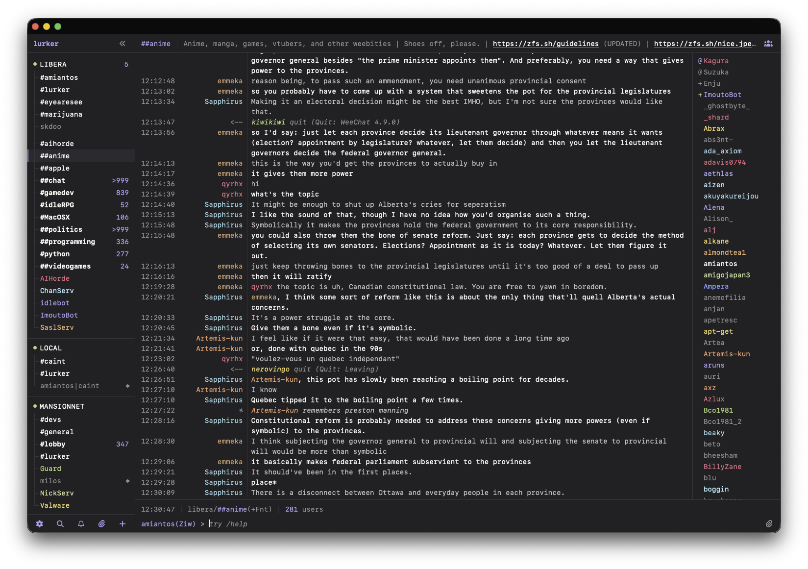

<h1>
  &nbsp;&nbsp;Lurker
</h1>

[](https://codecov.io/github/amiantos/lurker)

Lurker is a self-hosted modern IRC client with a retro flair, most easily described as "your personal [IRCCloud](https://www.irccloud.com), with [Weechat](https://weechat.org) looks".

Lurker runs as an always-on server that stays connected to IRC on your behalf, keeps full message history, and lets you reattach from any browser — desktop or mobile — picking up exactly where you left off. Open it on as many devices and tabs as you like; read state, settings, and history stay in sync everywhere; when all clients are disconnected, auto-away sets your status, and web push notifications inform you of highlights. Oh, and the icon rules.

# Features

- **Always-on and multi-user.** Each invited user connects to their own set of IRC networks, and Lurker stays connected when they're away.
- **Full history and search.** Every message is stored _and_ searchable. Auto-away triggers after your last client disconnects, and smart push notifications fire on highlights.
- **IRC with Modern Convienences.** Peer presence, automatic nick regain, join/part summarization, tab nickname completion, message drafts, saved messages, user notes, and a searchable channel browser w/ cache.
- **Image uploads.** Paste, drag, or pick an image; Lurker optimizes it, uploads it to [x0.at](https://x0.at) or [catbox.moe](https://catbox.moe), inserts the link into your message, and keeps a history of all your uploads.
- **Customizable UI.** The beautiful retro terminal-style interface has 40+ settings to customize it how you want, and you can freely pin and rearrange channels and DMs.
- **Installable.** Lurker is a PWA — install it as a native-feeling app on your phone, Mac, or PC straight from the browser.

# Screenshot (as macOS PWA)



# Rave Reviews

- `<cfuser> amiantos: holy shit, you made something better than irccloud`
- `<amigojapan> great, now that amiantos's chat client is catching up to IRC cloud, I think I can switch to it as my daily driver`
- `<skdoo> amiantos makes cool shit`

# Stack

- **Server** — TypeScript on Node (run via `tsx`), Express, `irc-framework`, `ws`, `better-sqlite3`, `sharp`, `web-push`
- **Client** — TypeScript, Vue 3, Vite, Pinia, `vue-router`
- **Tooling** — Vitest, oxlint, oxfmt

# Installation

## Install (Docker — Recommended)

```bash
curl -O https://raw.githubusercontent.com/amiantos/lurker/main/docker-compose.yml
docker compose up -d
```

Then open <http://localhost:8015> and create your admin account. Username + password is the default; passkeys are optional. See [SELF_HOSTING.md](SELF_HOSTING.md) for the full guide — reverse proxy + HTTPS, enabling passkeys, push notifications, updating, and backups.

## Deploy on DigitalOcean (one-shot)

For a public, HTTPS-enabled Lurker on a fresh droplet — no SSH required:

1. Create a droplet — the Docker Marketplace image at the smallest size is fine (vanilla Ubuntu 24.04 LTS works too).
2. At droplet creation, expand **Additional Options** and enable **User Scripts** (DigitalOcean's label for cloud-init user data — older guides call it "User data" or "Startup scripts"). Paste in the contents of [`deploy/digitalocean-cloud-init.sh`](deploy/digitalocean-cloud-init.sh), after editing `LURKER_DOMAIN` near the top of the script to your domain (e.g. `irc.yourdomain.com`).
3. Once the droplet exists, copy its public IP and add a DNS `A` record pointing your domain at it.
4. Give it a few minutes, then visit your domain.

You don't need the droplet's IP before creating it: the droplet boots and starts Caddy _before_ DNS exists, and Caddy keeps retrying Let's Encrypt until your `A` record resolves — so HTTPS comes up automatically a few minutes after you set the DNS record. (If you'd rather the certificate be ready the moment the droplet boots, reserve a [Reserved IP](https://docs.digitalocean.com/products/networking/reserved-ips/) first, point DNS at it, then create the droplet and assign that Reserved IP.)

Leave `LURKER_DOMAIN` empty for a plain-HTTP deployment instead — skip the DNS steps and open `http://<droplet-ip>:8015` directly. Deploy progress is logged to `/var/log/lurker-deploy.log` on the droplet.

**Updating:** SSH in (or open the DigitalOcean web console) and run:

```bash
cd /opt/lurker
docker compose pull && docker compose up -d
```

That's the same command whether or not you enabled HTTPS — the deploy script records the Caddy overlay in `.env`, so `docker compose` picks it up automatically. Your `data/` directory is left untouched.

## Manual Install (without Docker)

```bash
npm run install:all
npm run client:build
npm start
```

The server listens on port 8010 by default and stores everything in `./data/`. Override with the envvars documented in [`.env.example`](.env.example).

## Development

```bash
npm run install:all
cp .env.example .env   # defaults assume the local hostname documented in the file
npm run dev
```

# Community

- Chat in **#lurker** on [Libera.Chat](https://libera.chat).
- Follow what's planned and in progress on the [project kanban](https://kanban.bradroot.me/projects/12/45#share-auth-token=heTq3lrceDTKVlNYHKTH6MPaDqA2pJowusiqETTL).
- Say hi — I'm **amiantos** on Libera.Chat and [MansionNET](https://inthemansion.com).

# Why does this exist?

When I got back into IRC, I started off with [thelounge](https://github.com/thelounge/thelounge) but felt like it was kind of ugly, push notifications were very flaky, it was missing features, and development seemed to be stagnant. So I switched to [weechat](https://github.com/weechat) + [tmux](https://github.com/tmux/tmux) for a while, which looked and felt a lot better, but I missed being able to use IRC from my phone. Long story short, I had no choice but to make my own client, and with the help of some new friends on IRC, I believe I likely made one of the nicest IRC clients you've ever used. Try it out, and let me know what you think.

# License

Mozilla Public License 2.0 — see [LICENSE](LICENSE).
